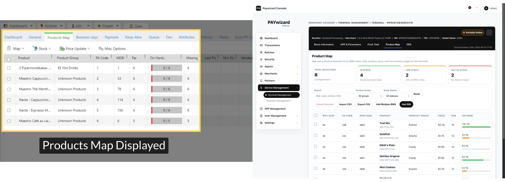
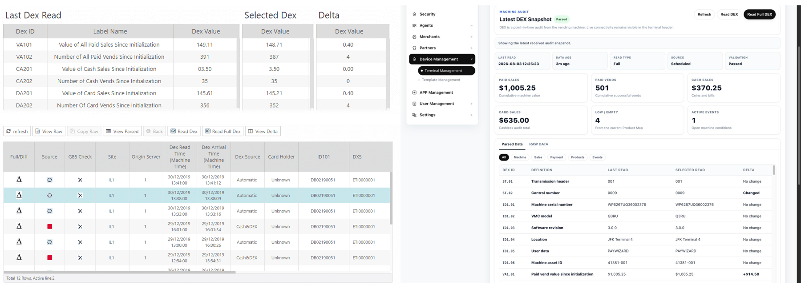
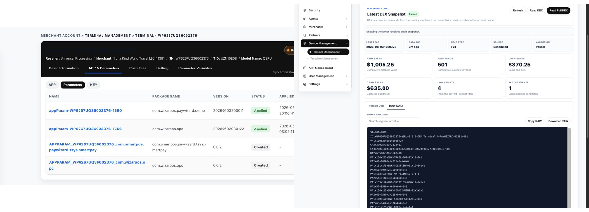

# Development Notes

- Current project UI development is based on PrimeVue: https://primevue.dev/

---

# Design QA

- Source visual truth path: user-provided inline screenshots 2 and 3 in the current conversation.
- Implementation screenshots:
  - `/tmp/paywizard-tsys.png`
  - `/tmp/paywizard-fiserv.png`
  - `/tmp/paywizard-tsys-tip.png`
  - `/tmp/paywizard-fiserv-tip.png`
  - `/tmp/paywizard-elavon.png`
  - `/tmp/paywizard-elavon-tooltip-error.png`
  - `/tmp/paywizard-oxpay.png`
- Viewport: 1920 × 1400 desktop.
- States: all six processor selections; focused captures for TSYS, FISERV, ELAVON, and OXPAY parameter groups.

**Full-view comparison evidence**

- The processor parameter area retains the existing Add Device page shell while matching the supplied three-column, underline-input layout.
- Every XML fieldset is represented as a tab in source order.
- Processor badges, template selector, tab treatment, field density, and default values remain visually aligned with the supplied references.

**Focused region comparison evidence**

- TSYS Tip & Taxes uses the supplied Enable/Disable segmented-control treatment and three-column field arrangement.
- FISERV Tip & Taxes uses the same control language and displays its XML default `010015020`.
- Field rows stay clean without XML comment or validation metadata beneath the controls.

**Required fidelity surfaces**

- Fonts and typography: existing prototype type stack and hierarchy preserved; tab, label, value, and helper levels are distinct.
- Spacing and layout rhythm: three-column desktop grid, horizontal tab rail, underline controls, and responsive two/one-column fallbacks verified.
- Colors and visual tokens: existing neutral palette preserved; selected segmented states use the reference black treatment.
- Image quality and asset fidelity: no image assets are required in the changed parameter area.
- Copy and content: fieldset names, labels, defaults, and options match the supplied XML files; comment and validation metadata are not displayed.

**Findings**

- No actionable P0, P1, or P2 visual or interaction mismatches remain.

**Patches made**

- Replaced hand-authored processor fields with XML-derived schemas.
- Added all TSYS, FISERV, ELAVON, NUVEI ATTD, NUVEI UPT, and OXPAY fieldsets, fields, defaults, select options, and validation metadata.
- Added a repeatable XML-to-JavaScript generator for processor parameter data.
- Kept required markers while removing XML comments and all visible validation metadata.
- Added segmented Enable/Disable controls and processor-aware app versions.
- Removed unsupported Worldpay selection from this XML-backed prototype.

**Verification**

- XML schema equality: passed.
- TSYS: 8 fieldsets and 80 fields.
- FISERV: 9 fieldsets and 85 fields.
- ELAVON: 9 fieldsets and 76 fields.
- NUVEI ATTD: 8 fieldsets and 38 fields.
- NUVEI UPT: 8 fieldsets and 57 fields.
- OXPAY: 4 fieldsets and 18 fields.
- TSYS MCC options: 294.
- State options: 51.
- Processor/version switching, tab switching, and segmented-control value changes: passed.
- ELAVON System ID tooltip, Terminal ID tooltip, suffix extraction, automatic zero-padding, error states, and recovery after correction: passed.

final result: passed

---

# Design QA — Transaction Actions

- Source visual truth path: user-provided Paywizard Transactions / ACTIONS screenshot in the current conversation.
- Implementation screenshots:
  - `assets/qa/qa-transaction-list-initial.png`
  - `assets/qa/qa-transaction-list-sale-menu.png`
  - `assets/qa/qa-transaction-list-refund-modal.png`
  - `assets/qa/qa-transaction-list-auth-menu.png`
- Viewport: 2048 × 900 desktop.
- States: default transaction list, Sale/Purchase ACTIONS menu, Refund form, Auth ACTIONS menu, validation error, successful follow-up transaction, and details navigation.

**Full-view comparison evidence**

- The ACTIONS popover is right-aligned to the row action button and uses the reference white card, subtle border/shadow, gray section headers, compact icon rows, and neutral typography.
- The existing Paywizard page shell, table density, colors, and control styles remain unchanged outside the requested ACTIONS workflow.

**Focused region comparison evidence**

- The Sale/Purchase menu contains the Action group with Transaction Details and Send Receipt, followed by the Terminal group with Refund and Tip Adjust.
- The Auth menu uses the same structure and replaces the terminal actions with Capture and Incremental.
- The Refund modal shows original transaction type, amount, transaction ID, merchant, terminal, and terminal SN before the editable follow-up amount.
- Follow-up iteration uses a compact two-column key/value summary with no per-field cards; Terminal Name is replaced by TID.

**Required fidelity surfaces**

- Fonts and typography: existing Poppins hierarchy is preserved; menu and modal labels use existing weights and sizes.
- Spacing and layout rhythm: menu rows, section headers, modal summary grid, amount control, and footer actions align consistently with the current prototype.
- Colors and visual tokens: existing neutral, dark, green, orange, blue, and purple transaction tokens are reused.
- Image quality and asset fidelity: local official Material Symbols SVG assets render sharply with no missing or fallback icon text.
- Copy and content: Action, Terminal, Transaction Details, Send Receipt, Refund, Tip Adjust, Capture, and Incremental labels match the requested workflow.

**Findings**

- No actionable P0, P1, or P2 visual or interaction issues remain.

**Patches made**

- Replaced network-dependent icon font rendering with local SVG icon assets after the first visual pass exposed fallback icon names.
- Added inline amount validation so Refund and Capture cannot exceed the original transaction amount.
- Added an Auth mock transaction so Capture and Incremental are directly testable in the prototype.
- Removed the modal subtitle and optional reference/note field.
- Replaced six boxed summary cards with a borderless, compact key/value layout.

**Verification**

- JavaScript syntax and `git diff --check`: passed.
- Sale/Purchase action mapping: passed.
- Auth action mapping: passed.
- Refund, Tip Adjust, Capture, and Incremental modal titles, amount labels, currencies, and source summaries: passed.
- Refund amount validation and successful follow-up row creation: passed.
- Transaction Details navigation to `/11.transaction_detail_redesign.html`: passed.
- Local icon loading: 0 broken assets.
- Compact Refund modal screenshot: `assets/qa/qa-transaction-list-refund-modal-compact.png`.
- MID replaces Merchant in the original transaction summary.
- Transaction Channel displays the configured processor channel (TSYS, FISERV, ELAVON, or NUVEI) and is inherited by follow-up transactions.
- Capture modal channel screenshot: `assets/qa/qa-transaction-list-capture-channel.png`.
- Summary order now places MID and TID on the same row; Transaction Channel is shortened to Channel.
- Amount guidance uses a higher-contrast neutral callout with a left accent and semibold text.
- Reordered Refund modal screenshot: `assets/qa/qa-transaction-list-refund-reordered.png`.
- Replaced the amount callout card with a borderless inline calculation row using existing typography and divider tokens.
- Tip Adjust now presents Original sale and New total as two compact values, with only the resulting total emphasized.
- Redesigned Tip Adjust screenshot: `assets/qa/qa-transaction-list-tip-help-redesign.png`.

final result: passed

---

# Design QA — Nayax Product Map and DEX

- Source visual truth: the two Nayax / Paywizard screenshots supplied in the current conversation, the Nayax Product Map field-definition and DEX administration references linked in the approved plan, and the unchanged local Paywizard baseline `1.terminalmanage.html`.
- Implementation target: `1.terminalmanage_nayax.html`.
- Browser-rendered implementation screenshots:
  - `assets/qa/qa-nayax-product-map-viewport.png`
  - `assets/qa/qa-nayax-dex-parsed-viewport.png`
  - `assets/qa/qa-nayax-dex-raw-viewport.png`
- Side-by-side comparison boards:
  - `assets/qa/qa-nayax-product-map-comparison.png`
  - `assets/qa/qa-nayax-dex-parsed-comparison.png`
  - `assets/qa/qa-nayax-dex-raw-comparison.png`
- Viewports: 1440 × 1000 desktop, 820 × 1000 tablet, and 390 × 844 phone.

## Product Map comparison

- The implementation preserves the Nayax concepts and field order for Product, Product Group, PA Code, MDB Code, PAR, On Hand, and Missing while fitting the existing Paywizard black header, blue active line, neutral cards, compact table, and status colors.
- Product Map adds the required BIN / Slot, SKU, Price, status, actions, summary, search, filters, CRUD controls, CSV controls, and horizontal table scrolling without changing the surrounding terminal-management shell.
- Inventory bars and green / yellow / red states make On Hand and Missing easier to scan while retaining the behavior shown in the Nayax reference.

## Parsed DEX comparison

- Last Read, Selected Read, and Delta align directly with the Nayax comparison model; the Paywizard implementation adds explicit machine-audit metadata and KPI cards above the same comparison table.
- Full / Delta, source, read time, validation, record count, and history selection remain visible in one workflow.
- The parsed table uses an independent 620px scroll region with a sticky header, preventing a full DEX read from creating an excessively long page.

## RAW DATA comparison

- RAW DATA reuses the existing Paywizard terminal card, typography, spacing, neutral controls, and black-primary-button treatment.
- The dark monospace payload surface is visually distinct from parsed business data and keeps search, copy, and download actions immediately available.

## Interaction and state verification

- Removed terminal-level `Setting` and `Parameter Variables` tabs, panels, and script registration; the global sidebar `Settings` item remains.
- Default entry still opens `APP & Parameters > Parameters`; legacy `?tab=settings`, `?tab=params`, and unknown tab values canonicalize to `?tab=appfw`.
- Product Map single add, edit, bulk add, single / bulk delete, search, group and stock filters, uniqueness rules, MDB numeric validation, non-negative numeric validation, `On Hand ≤ PAR`, Missing calculation, and inventory-state thresholds: passed.
- CSV quoted-field parsing, valid-row append, duplicate / invalid-row isolation, no-overwrite behavior, export filename, headers, and complete-map content: passed.
- DEX Delta and Full reads: `Queued → Reading → Parsed` passed; both append to history and update metadata, KPIs, parsed values, and RAW DATA.
- DEX Parsed / RAW tabs, category filtering, PA Code to Product Map association, RAW search, clipboard copy, and download: passed.
- Historical Parsed, Failed, Warning, Stale, and No Data snapshots update the overview, validation state, parsed message, RAW message, and KPI availability as intended.
- Main tab and DEX inner-tab keyboard navigation, modal focus entry, Escape close, focus restoration, ARIA relationships, and live status feedback: passed.
- APP & Parameters parameter preview, Push Task, Basic Information, sidebar, terminal status, and existing action flows: passed.
- Desktop, tablet, and phone widths have no document-level horizontal clipping; Product Map and DEX tables scroll inside their own containers, and DEX grids collapse below 900px.
- Browser console errors / warnings: 0.
- Inline JavaScript syntax, duplicate IDs, and missing `aria-controls` targets: passed.

## Findings

- No actionable P0, P1, or P2 visual, responsive, accessibility, or interaction mismatches remain.
- The narrow-screen shell keeps the project's existing stacked sidebar-first navigation pattern; the requested terminal content remains fully reachable and uncropped.

final result: passed
