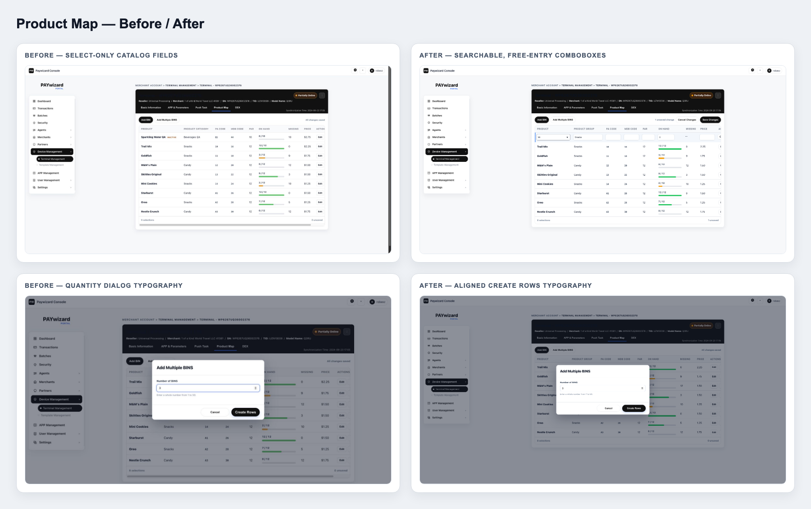
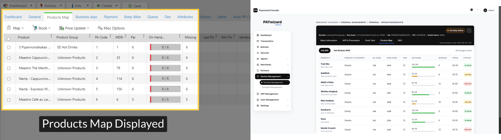
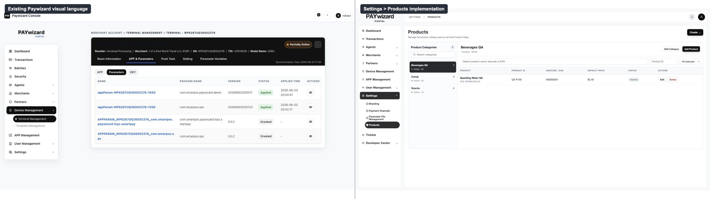
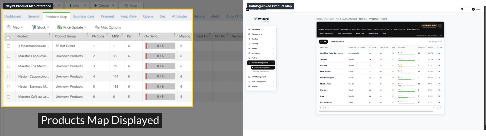
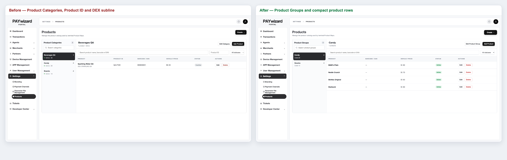
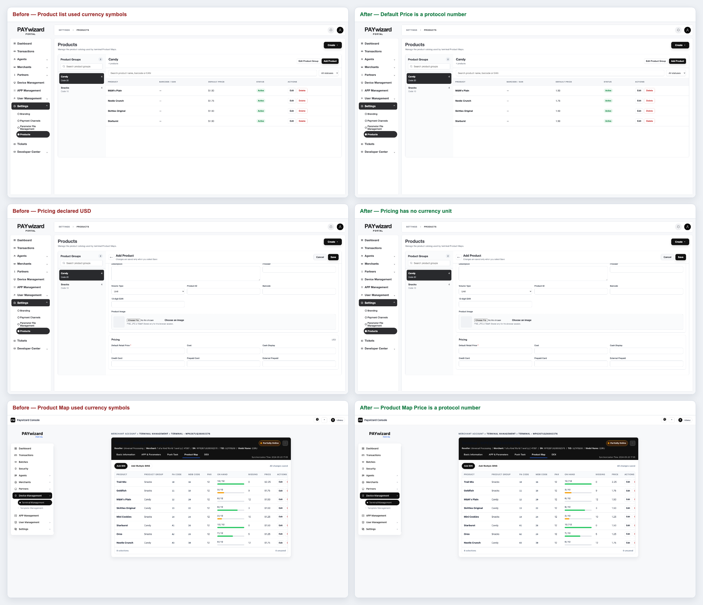

# Development Notes

- Current project UI development is based on PrimeVue: https://primevue.dev/

---

# Design QA

- Source visual truth path: user-provided inline screenshots 2 and 3 in the current conversation.
- Implementation screenshots:
  - `/tmp/paywizard-tsys.png`
  - `/tmp/paywizard-fiserv.png`
  - `/tmp/paywizard-tsys-tip.png`
  - `/tmp/paywizard-fiserv-tip.png`
  - `/tmp/paywizard-elavon.png`
  - `/tmp/paywizard-elavon-tooltip-error.png`
  - `/tmp/paywizard-oxpay.png`
- Viewport: 1920 × 1400 desktop.
- States: all six processor selections; focused captures for TSYS, FISERV, ELAVON, and OXPAY parameter groups.

**Full-view comparison evidence**

- The processor parameter area retains the existing Add Device page shell while matching the supplied three-column, underline-input layout.
- Every XML fieldset is represented as a tab in source order.
- Processor badges, template selector, tab treatment, field density, and default values remain visually aligned with the supplied references.

**Focused region comparison evidence**

- TSYS Tip & Taxes uses the supplied Enable/Disable segmented-control treatment and three-column field arrangement.
- FISERV Tip & Taxes uses the same control language and displays its XML default `010015020`.
- Field rows stay clean without XML comment or validation metadata beneath the controls.

**Required fidelity surfaces**

- Fonts and typography: existing prototype type stack and hierarchy preserved; tab, label, value, and helper levels are distinct.
- Spacing and layout rhythm: three-column desktop grid, horizontal tab rail, underline controls, and responsive two/one-column fallbacks verified.
- Colors and visual tokens: existing neutral palette preserved; selected segmented states use the reference black treatment.
- Image quality and asset fidelity: no image assets are required in the changed parameter area.
- Copy and content: fieldset names, labels, defaults, and options match the supplied XML files; comment and validation metadata are not displayed.

**Findings**

- No actionable P0, P1, or P2 visual or interaction mismatches remain.

**Patches made**

- Replaced hand-authored processor fields with XML-derived schemas.
- Added all TSYS, FISERV, ELAVON, NUVEI ATTD, NUVEI UPT, and OXPAY fieldsets, fields, defaults, select options, and validation metadata.
- Added a repeatable XML-to-JavaScript generator for processor parameter data.
- Kept required markers while removing XML comments and all visible validation metadata.
- Added segmented Enable/Disable controls and processor-aware app versions.
- Removed unsupported Worldpay selection from this XML-backed prototype.

**Verification**

- XML schema equality: passed.
- TSYS: 8 fieldsets and 80 fields.
- FISERV: 9 fieldsets and 85 fields.
- ELAVON: 9 fieldsets and 76 fields.
- NUVEI ATTD: 8 fieldsets and 38 fields.
- NUVEI UPT: 8 fieldsets and 57 fields.
- OXPAY: 4 fieldsets and 18 fields.
- TSYS MCC options: 294.
- State options: 51.
- Processor/version switching, tab switching, and segmented-control value changes: passed.
- ELAVON System ID tooltip, Terminal ID tooltip, suffix extraction, automatic zero-padding, error states, and recovery after correction: passed.

final result: passed

---

# Design QA — Product Map Editable Catalog Cells

- Source visual truth: the annotated Product Map validation, Add Multiple BINS, Nayax inline pencil-editing, and editable Product Group screenshots supplied in the current conversation.
- Implementation target: `1.terminalmanage_nayax.html?tab=productmap`.
- Browser-rendered evidence:
  - `assets/qa/qa-product-map-create-rows-typography.png`
  - `assets/qa/qa-product-map-autocomplete-filter.png`
  - `assets/qa/qa-product-map-new-catalog-draft.png`
  - `assets/qa/qa-product-map-quick-edit.png`
- Combined before/after board: `assets/qa/qa-product-map-editable-comparison.png`.
- Viewport: 2048 × 1054 CSS pixels at device scale factor 1.

## Comparison evidence

- PA Code is optional. An empty value no longer highlights the cell or appears in the external validation summary; a supplied value still accepts exactly two letters or digits and remains unique when present.
- Product Group and Product are editable comboboxes. Typing filters the browser-native suggestion list, exact matches reuse catalog records, and unmatched names create a new Product Group or Product when the Product Map is saved.
- Product suggestions are scoped to the selected Product Group. Changing Product Group clears the prior Product and price so an unrelated catalog value cannot be retained.
- Saved Product and Product Group cells expose a pencil affordance on hover and keyboard focus; activation opens the row editor and focuses the selected field.
- Add Multiple BINS retains the compact dialog. Cancel and Create Rows now share the same 13px, 700-weight button typography and aligned control height.

## Interaction and regression verification

- Blank PA Code save, optional PA uniqueness behavior, and Product Map persistence: passed.
- Existing Product Group/Product selection, type-ahead filtering, default-price copy, and independent terminal price override: passed.
- New Product Group and Product creation from an inline Product Map row, followed by cross-page catalog visibility: passed.
- Quick-edit focus behavior for Product and Product Group, keyboard navigation, and draft cancellation: passed.
- Inactive catalog entries remain visible only for existing mappings and are excluded from new suggestions: passed.
- Browser console errors and warnings during final captures: 0.
- Playwright regression suite: 7 passed.
- JavaScript syntax and `git diff --check`: passed.

## Findings

- No actionable P0, P1, or P2 visual, responsive, accessibility, or interaction findings remain.

final result: passed

# Design QA — Transaction Actions

- Source visual truth path: user-provided Paywizard Transactions / ACTIONS screenshot in the current conversation.
- Implementation screenshots:
  - `assets/qa/qa-transaction-list-initial.png`
  - `assets/qa/qa-transaction-list-sale-menu.png`
  - `assets/qa/qa-transaction-list-refund-modal.png`
  - `assets/qa/qa-transaction-list-auth-menu.png`
- Viewport: 2048 × 900 desktop.
- States: default transaction list, Sale/Purchase ACTIONS menu, Refund form, Auth ACTIONS menu, validation error, successful follow-up transaction, and details navigation.

**Full-view comparison evidence**

- The ACTIONS popover is right-aligned to the row action button and uses the reference white card, subtle border/shadow, gray section headers, compact icon rows, and neutral typography.
- The existing Paywizard page shell, table density, colors, and control styles remain unchanged outside the requested ACTIONS workflow.

**Focused region comparison evidence**

- The Sale/Purchase menu contains the Action group with Transaction Details and Send Receipt, followed by the Terminal group with Refund and Tip Adjust.
- The Auth menu uses the same structure and replaces the terminal actions with Capture and Incremental.
- The Refund modal shows original transaction type, amount, transaction ID, merchant, terminal, and terminal SN before the editable follow-up amount.
- Follow-up iteration uses a compact two-column key/value summary with no per-field cards; Terminal Name is replaced by TID.

**Required fidelity surfaces**

- Fonts and typography: existing Poppins hierarchy is preserved; menu and modal labels use existing weights and sizes.
- Spacing and layout rhythm: menu rows, section headers, modal summary grid, amount control, and footer actions align consistently with the current prototype.
- Colors and visual tokens: existing neutral, dark, green, orange, blue, and purple transaction tokens are reused.
- Image quality and asset fidelity: local official Material Symbols SVG assets render sharply with no missing or fallback icon text.
- Copy and content: Action, Terminal, Transaction Details, Send Receipt, Refund, Tip Adjust, Capture, and Incremental labels match the requested workflow.

**Findings**

- No actionable P0, P1, or P2 visual or interaction issues remain.

**Patches made**

- Replaced network-dependent icon font rendering with local SVG icon assets after the first visual pass exposed fallback icon names.
- Added inline amount validation so Refund and Capture cannot exceed the original transaction amount.
- Added an Auth mock transaction so Capture and Incremental are directly testable in the prototype.
- Removed the modal subtitle and optional reference/note field.
- Replaced six boxed summary cards with a borderless, compact key/value layout.

**Verification**

- JavaScript syntax and `git diff --check`: passed.
- Sale/Purchase action mapping: passed.
- Auth action mapping: passed.
- Refund, Tip Adjust, Capture, and Incremental modal titles, amount labels, currencies, and source summaries: passed.
- Refund amount validation and successful follow-up row creation: passed.
- Transaction Details navigation to `/11.transaction_detail_redesign.html`: passed.
- Local icon loading: 0 broken assets.
- Compact Refund modal screenshot: `assets/qa/qa-transaction-list-refund-modal-compact.png`.
- MID replaces Merchant in the original transaction summary.
- Transaction Channel displays the configured processor channel (TSYS, FISERV, ELAVON, or NUVEI) and is inherited by follow-up transactions.
- Capture modal channel screenshot: `assets/qa/qa-transaction-list-capture-channel.png`.
- Summary order now places MID and TID on the same row; Transaction Channel is shortened to Channel.
- Amount guidance uses a higher-contrast neutral callout with a left accent and semibold text.
- Reordered Refund modal screenshot: `assets/qa/qa-transaction-list-refund-reordered.png`.
- Replaced the amount callout card with a borderless inline calculation row using existing typography and divider tokens.
- Tip Adjust now presents Original sale and New total as two compact values, with only the resulting total emphasized.
- Redesigned Tip Adjust screenshot: `assets/qa/qa-transaction-list-tip-help-redesign.png`.

final result: passed

---

# Design QA — Nayax Product Map and DEX

- Source visual truth: the two Nayax / Paywizard screenshots supplied in the current conversation, the Nayax Product Map field-definition and DEX administration references linked in the approved plan, and the unchanged local Paywizard baseline `1.terminalmanage.html`.
- Implementation target: `1.terminalmanage_nayax.html`.
- Browser-rendered implementation screenshots:
  - `assets/qa/qa-nayax-product-map-viewport.png`
  - `assets/qa/qa-nayax-dex-parsed-viewport.png`
  - `assets/qa/qa-nayax-dex-raw-viewport.png`
- Side-by-side comparison boards:
  - `assets/qa/qa-nayax-product-map-comparison.png`
  - `assets/qa/qa-nayax-dex-parsed-comparison.png`
  - `assets/qa/qa-nayax-dex-raw-comparison.png`
- Viewports: 1440 × 1000 desktop, 820 × 1000 tablet, and 390 × 844 phone.

## Product Map comparison

- The implementation preserves the Nayax concepts and field order for Product, Product Group, PA Code, MDB Code, PAR, On Hand, and Missing while fitting the existing Paywizard black header, blue active line, neutral cards, compact table, and status colors.
- Product Map adds the required BIN / Slot, SKU, Price, status, actions, summary, search, filters, CRUD controls, CSV controls, and horizontal table scrolling without changing the surrounding terminal-management shell.
- Inventory bars and green / yellow / red states make On Hand and Missing easier to scan while retaining the behavior shown in the Nayax reference.

## Parsed DEX comparison

- Last Read, Selected Read, and Delta align directly with the Nayax comparison model; the Paywizard implementation adds explicit machine-audit metadata and KPI cards above the same comparison table.
- Full / Delta, source, read time, validation, record count, and history selection remain visible in one workflow.
- The parsed table uses an independent 620px scroll region with a sticky header, preventing a full DEX read from creating an excessively long page.

## RAW DATA comparison

- RAW DATA reuses the existing Paywizard terminal card, typography, spacing, neutral controls, and black-primary-button treatment.
- The dark monospace payload surface is visually distinct from parsed business data and keeps search, copy, and download actions immediately available.

## Interaction and state verification

- Removed terminal-level `Setting` and `Parameter Variables` tabs, panels, and script registration; the global sidebar `Settings` item remains.
- Default entry still opens `APP & Parameters > Parameters`; legacy `?tab=settings`, `?tab=params`, and unknown tab values canonicalize to `?tab=appfw`.
- Product Map single add, edit, bulk add, single / bulk delete, search, group and stock filters, uniqueness rules, MDB numeric validation, non-negative numeric validation, `On Hand ≤ PAR`, Missing calculation, and inventory-state thresholds: passed.
- CSV quoted-field parsing, valid-row append, duplicate / invalid-row isolation, no-overwrite behavior, export filename, headers, and complete-map content: passed.
- DEX Delta and Full reads: `Queued → Reading → Parsed` passed; both append to history and update metadata, KPIs, parsed values, and RAW DATA.
- DEX Parsed / RAW tabs, category filtering, PA Code to Product Map association, RAW search, clipboard copy, and download: passed.
- Historical Parsed, Failed, Warning, Stale, and No Data snapshots update the overview, validation state, parsed message, RAW message, and KPI availability as intended.
- Main tab and DEX inner-tab keyboard navigation, modal focus entry, Escape close, focus restoration, ARIA relationships, and live status feedback: passed.
- APP & Parameters parameter preview, Push Task, Basic Information, sidebar, terminal status, and existing action flows: passed.
- Desktop, tablet, and phone widths have no document-level horizontal clipping; Product Map and DEX tables scroll inside their own containers, and DEX grids collapse below 900px.
- Browser console errors / warnings: 0.
- Inline JavaScript syntax, duplicate IDs, and missing `aria-controls` targets: passed.

## Findings

- No actionable P0, P1, or P2 visual, responsive, accessibility, or interaction mismatches remain.
- The narrow-screen shell keeps the project's existing stacked sidebar-first navigation pattern; the requested terminal content remains fully reachable and uncropped.

final result: passed

---

# Design QA — Product Map Inline Editing Revision

- Source visual truth: the latest Nayax Product Map screenshot supplied in the conversation and the existing Paywizard terminal-management shell.
- Implementation target: `1.terminalmanage_nayax.html?tab=productmap`.
- Browser-rendered screenshots:
  - `assets/qa/qa-nayax-product-map-inline-viewport.png`
  - `assets/qa/qa-nayax-product-map-inline-edit.png`
- Side-by-side comparison board:
  - `assets/qa/qa-nayax-product-map-inline-comparison.png`
- Browser viewport for the comparison capture: 1710 × 876; the wide table remains contained by its own horizontal scroll surface.

## Visual comparison

- Removed the Product Map summary cards, search and filter controls, CSV controls, bulk-selection controls, checkbox column, and visible BIN / Slot column.
- Reordered the table to follow the supplied Nayax reference: Product, Product Category, PA Code, MDB Code, PAR, On Hand, Missing, Price, Status, and Actions.
- Preserved the Nayax-style inventory bars and the current project's green, yellow, and red stock states.
- Kept the terminal black header, blue active-tab line, neutral table surface, black primary buttons, border treatment, and type scale consistent with the surrounding project.

## Interaction verification

- `Add BIN` inserts one editable row directly into the table; no dialog is created or opened.
- `Add Multiple BINS` inserts three editable rows directly into the table; no dialog is created or opened.
- Inline product name, SKU, category, PA Code, MDB Code, PAR, On Hand, and price fields update Missing, stock progress, and status in place.
- Global `Save Changes` commits all valid pending rows atomically; `Cancel Changes` and per-row Cancel discard unsaved edits.
- Existing-row Edit uses the same inline table treatment; it does not open the legacy editor dialog.
- Duplicate PA Code validation was exercised in the browser and correctly blocked saving with an inline error.
- Single-row Delete still uses the existing confirmation flow and updates Product Map / DEX session data after confirmation.
- JavaScript syntax check and duplicate-ID check: passed.
- Responsive CSS review: the toolbar stacks below 900px, controls become full-width below 560px, and the table stays inside its independent scroll container.

## Findings

- No visible Product Map filters, checkbox column, BIN / Slot column, or add modal remain in the revised primary workflow.
- No actionable P0, P1, or P2 mismatch remains against the requested Product-first Nayax table direction.

final result: passed

---

# Design QA — Product Map Top-Row Insertion Revision

- Source visual truth: the user-provided Product Map screenshot in the current conversation, represented by the prior browser capture `assets/qa/qa-nayax-product-map-inline-edit.png` for pixel-aligned comparison.
- Implementation: `1.terminalmanage_nayax.html?tab=productmap`.
- Implementation screenshots:
  - `assets/qa/qa-nayax-product-map-top-insert.png`
  - `assets/qa/qa-nayax-product-map-quantity-dialog.png`
- Full-view comparison: `assets/qa/qa-nayax-product-map-top-insert-comparison.png`.
- Source and implementation captures use the same desktop browser surface and density; both were normalized to 1200 × 675 panels in the 2400 × 675 comparison board.
- State: four unsaved rows inserted directly below the table header; separate quantity-dialog state captured at its default value of 3.

## Findings and fixes

- Earlier P2: draft rows appeared after all existing rows. Fixed by rendering all pending additions before persisted Product Map records.
- Earlier P2: the Product column exposed SKU and a `New BIN` label. Fixed by showing only the product-name input and distinguishing draft rows through a pale blue row background with a subtle left accent.
- Earlier P2: the Status column remained visible after inventory status was already communicated by the On Hand progress color. Fixed by removing Status from the active Product Map header, persisted rows, and inline rows.
- Earlier P1: `Add Multiple BINS` assumed three rows without asking. Fixed with an accessible project-styled quantity dialog, whole-number validation, a 1–50 range, Cancel/Escape behavior, and focus entry.

## Fidelity surfaces

- Fonts and typography: unchanged project font stack, weights, header casing, and numeric emphasis; passed.
- Spacing and layout rhythm: editable rows begin immediately below the header and align with all nine active columns; passed.
- Colors and tokens: draft background, input borders, inventory colors, modal overlay, and black primary actions reuse existing project tokens; passed.
- Image and asset fidelity: no new imagery or approximated assets were introduced; not applicable.
- Copy and content: SKU, `New BIN`, and Status are absent from the active workflow; quantity copy and validation are concise English project copy; passed.

## Interaction verification

- Single Add BIN creates one first-row draft without a dialog: passed.
- Add Multiple BINS opens the quantity dialog; invalid 0 is rejected and entering 4 creates four first-row drafts: passed.
- Product Map save succeeds without SKU and still enforces product name, category, PA Code, MDB Code, price, PAR, On Hand, uniqueness, and stock rules: passed.
- Quantity modal cancel, focus, and no-dialog-after-confirm behavior: passed.
- DEX tab regression and Product Map return navigation: passed.
- JavaScript syntax, duplicate IDs, and `git diff --check`: passed.

## Findings

- No actionable P0, P1, or P2 findings remain.
- Focused comparison is not separate because the table region is large and legible in the normalized full-view comparison; the quantity dialog is captured separately at readable scale.

final result: passed

---

# Design QA — Product Map Code Rules and Simplified Quantity Dialog

- Source visual truth: the latest Product Map draft-row and quantity-dialog screenshots supplied in the conversation, represented by the prior implementation captures `assets/qa/qa-nayax-product-map-top-insert.png` and `assets/qa/qa-nayax-product-map-quantity-dialog.png` for normalized comparison.
- Implementation: `1.terminalmanage_nayax.html?tab=productmap`.
- Implementation screenshots:
  - `assets/qa/qa-nayax-product-map-empty-draft.png`
  - `assets/qa/qa-nayax-product-map-simple-quantity-dialog.png`
- Side-by-side comparison: `assets/qa/qa-nayax-product-map-rules-comparison.png` at 2400 × 1350; each panel normalized to 1200 × 675 at the same desktop browser density.
- States: one newly inserted empty draft row and the default Add Multiple BINS quantity dialog.

## Findings and fixes

- Earlier P1: PA and MDB examples and validation allowed longer codes. Fixed by converting the seed Product Map to two-character PA Codes and two-digit MDB Codes, enforcing exact lengths, stripping invalid MDB characters, and normalizing PA letters to uppercase.
- Earlier P2: new rows prefilled PA, MDB, PAR, On Hand, and Price and rendered an inventory bar. Fixed so every draft field is empty except On Hand = 0; Missing shows `--` until PAR is entered; draft/edit rows do not render stock progress.
- Earlier P2: the quantity dialog duplicated Cancel with a top Close action, included unnecessary subtitle copy, and used unequal action widths. Fixed by removing the subtitle and header button and setting both footer actions to 132 × 40 px.

## Fidelity surfaces

- Fonts and typography: project font stack, title hierarchy, table labels, and button weights remain unchanged; passed.
- Spacing and layout rhythm: the simpler 440px modal reduces unused vertical space and keeps equal button geometry; the empty draft remains aligned to the nine-column grid; passed.
- Colors and tokens: existing modal overlay, borders, focus ring, draft-row tint, and persisted inventory colors are preserved; passed.
- Image and asset fidelity: no image assets are present or required in this revision; not applicable.
- Copy and content: removed redundant dialog copy and Close label; retained only title, field label, compact range guidance, Cancel, and Create Rows; passed.

## Interaction verification

- New-row values are empty for Product, Category, PA, MDB, PAR, and Price; On Hand is exactly 0: passed.
- New/edit rows contain no inventory progress bar; persisted rows still show progress bars: passed.
- PA Code rejects one or more than two characters, allows two alphanumeric characters, and saves lowercase input as uppercase: passed.
- MDB Code strips non-digits and rejects values that are not exactly two digits: passed.
- Quantity dialog contains no subtitle or header Close button; Cancel and Create Rows both measure 132 × 40 px: passed.
- Quantity dialog Escape behavior and DEX tab regression: passed.
- JavaScript syntax, duplicate IDs, and `git diff --check`: passed.

## Findings

- No actionable P0, P1, or P2 findings remain.
- The combined comparison board provides readable focused evidence for both changed surfaces, so no additional crop is required.

final result: passed

---

# Design QA — Product Map Validation Placement and Newest-First Ordering

- Source visual truth: the three latest Product Map screenshots supplied in the conversation, covering in-row error overflow, PA/MDB placeholder hints, and a newly saved record at the bottom.
- Implementation: `1.terminalmanage_nayax.html?tab=productmap`.
- Implementation screenshots:
  - `assets/qa/qa-nayax-product-map-validation-summary.png`
  - `assets/qa/qa-nayax-product-map-newest-first.png`
- Delta comparison board: `assets/qa/qa-nayax-product-map-errors-order-comparison.png` at 2700 × 506. The prior empty-draft capture is shown at left, the external validation state at center, and newest-first saved state at right; each panel is normalized to 900 × 506 at the same browser density.

## Findings and fixes

- Earlier P1: row-level error copy overflowed the narrow Actions cell and increased row height. Fixed by moving detailed validation into a full-width alert between the action toolbar and table; invalid inputs retain only their red field borders.
- Earlier P3: `2 chars` and `2 digits` placeholders created repetitive visual noise. Fixed by leaving both PA Code and MDB Code inputs visually empty while retaining exact-length validation.
- Earlier P1: newly saved records were appended below all seed records. Fixed by prepending each newly saved record or batch; later save operations appear above earlier saves and the seed map.

## Fidelity surfaces

- Fonts and typography: the alert uses the existing compact UI font, 12px body text, and semibold title; passed.
- Spacing and layout rhythm: validation occupies its own horizontal region without altering table column widths or draft-row height; passed.
- Colors and tokens: alert background, border, left accent, and invalid field borders reuse existing red semantic tokens; passed.
- Image and asset fidelity: no images or icons were introduced; not applicable.
- Copy and content: detailed errors are grouped by `New row N`; redundant PA/MDB placeholders are absent; the toolbar continues to show the unsaved count rather than duplicating the error message; passed.

## Interaction verification

- Invalid price and duplicate MDB Code produce two red field borders and one external summary; the Actions cell contains only Cancel: passed.
- Editing one invalid row clears only that row's summary entry while preserving errors from other rows: passed by state-model review and targeted handler verification.
- Two sequential saves produce `Product Two`, `Product One`, then the seed data: passed.
- PA/MDB inputs have empty placeholder attributes: passed.
- JavaScript syntax, duplicate IDs, and `git diff --check`: passed.

## Findings

- No actionable P0, P1, or P2 findings remain.
- The three-panel comparison is sufficient because the changed alert, draft inputs, and first persisted rows are all legible at normalized scale.

final result: passed

---

# Design QA — Products Catalog and Product Map Integration

- Source visual truth: the Paywizard Portal Settings screenshot supplied in the current conversation, the approved Nayax Classic Core category/product workflow, the supplied Nayax Product Map reference, and the existing Paywizard terminal shell.
- Implementation targets: `35.product_management.html`, `scripts/product-catalog.js`, and `1.terminalmanage_nayax.html?tab=productmap` / `?tab=dex`.
- Browser-rendered implementation screenshots:
  - `assets/qa/qa-products-catalog-viewport.png`
  - `assets/qa/qa-product-map-catalog-linked.png`
  - `assets/qa/qa-dex-catalog-linked.png`
- Combined comparison boards:
  - `assets/qa/qa-products-catalog-comparison.png`
  - `assets/qa/qa-product-map-catalog-comparison.png`
- Viewports: 2048 × 1054 desktop, 899 × 900 tablet, and 390 × 844 phone.

## Products catalog comparison

- The new page reuses the Portal logo, left navigation, Settings expansion, breadcrumb top bar, black primary actions, neutral borders, and existing typography from the supplied Paywizard reference.
- The master-detail workspace keeps Product Categories visible beside the selected category's Products table on desktop, then collapses to a single readable column below 900px.
- Category and product creation/editing remain in the right detail surface rather than introducing a large workflow modal.

## Product Map comparison

- Product remains the first column and Product Category the second, matching the requested Nayax table direction.
- New rows start at the top with an empty Category selector; Product stays disabled until Category is selected, then lists only Active products in that category.
- Selecting a product copies its Default Retail Price while retaining terminal-level price editing; On Hand defaults to 0 and draft rows do not display inventory progress.
- Existing mappings retain inactive products and show the inactive state without exposing them to new Product selections.

## Interaction and data verification

- Operator-level session catalog seeds Snacks, Candy, and eight products, safely recovers corrupt/incompatible storage, and publishes versioned catalog/map APIs: passed.
- Category fields, VAT rows, product information, identifiers, pricing, nutrition, age verification, tax, tray, and fill fields save and edit in the detail editor: passed.
- Category name/code and Product ID/Barcode/EAN uniqueness, 13-digit EAN, 100-character Product Name, 16-character DEX Name, and non-negative two-decimal pricing validation: passed.
- No-category and empty-category states, category preselection, Active/Inactive filtering, referenced-product archive protection, and non-empty-category deletion protection: passed.
- Product Map Category → Product focus order, active-only options, default price copy, independent price override, exact two-character PA Code, exact two-digit numeric MDB Code, On Hand default, external error summary, bulk-row independence, and newest-first saves: passed.
- DEX uses `DEX Name || Product Name`, labels parsed values as `DEX Product Name`, and keeps historical raw/parsed snapshots immutable after catalog edits: passed.
- Products navigation is present in the Nayax terminal prototype, the scoped Branding Settings prototype, and the prototype index: passed.
- Desktop and mobile pages have no document-level horizontal overflow; Product and Product Map tables scroll only inside their local containers. Products becomes one column below 900px, DEX metadata/KPI grids become two columns on tablet and one on phone: passed.
- Create menu, quantity dialog, delete/archive confirmation, dirty-leave confirmation, Escape behavior, focus trap/restoration, keyboard sequence, and ARIA/live feedback: passed.
- Browser console errors and warnings after final reload: 0.
- Inline JavaScript, shared-store JavaScript, Playwright test syntax, static IDs, and `git diff --check`: passed.

## Findings

- No actionable P0, P1, or P2 visual, responsive, accessibility, data-flow, or interaction mismatches remain.
- The mobile shell preserves the project's existing sidebar-first pattern; category/product content remains reachable and wide tables remain locally scrollable.

final result: passed

---

# Design QA — Product Groups Catalog Simplification

- Source visual truth: the Products list, Product Category editor, Product editor, Pricing, and Product Map screenshots supplied in the current conversation, plus the existing Paywizard Portal shell.
- Implementation targets: `35.product_management.html`, `scripts/product-catalog.js`, and `1.terminalmanage_nayax.html?tab=productmap`.
- Browser-rendered screenshots:
  - `assets/qa/qa-products-groups-list.png`
  - `assets/qa/qa-products-groups-create-menu.png`
  - `assets/qa/qa-product-group-form-simplified.png`
  - `assets/qa/qa-product-form-simplified.png`
  - `assets/qa/qa-product-pricing-first.png`
  - `assets/qa/qa-products-groups-mobile.png`
  - `assets/qa/qa-product-map-groups-linked.png`
- Combined before/after board: `assets/qa/qa-products-groups-comparison.png`.
- Viewports: 2048 × 1054 desktop and 390 × 844 phone.

## Visual comparison

- All visible Product Category language is now Product Group across the catalog and Product Map.
- The Create control is a consistent 108 × 40px black action with a 10px radius; its two menu actions align within the page header without the previous oversized outline.
- Product Group editing contains only Product Group Name, Code, Description, and Image. Operator, Status, and VAT sections are absent.
- Product editing has no Operator, Nutrition, or Miscellaneous sections. Pricing starts with required Default Retail Price.
- Product rows now contain one-line product names and omit Product ID and DEX sublines; Barcode / EAN, Default Price, Status, and Actions remain.
- Mobile content collapses to one column without document-level horizontal overflow; the product table retains local horizontal scrolling.

## Interaction and regression verification

- Create menu opens Add Product Group and Add Product; both actions enter the correct right-side editor: passed.
- Product Group create/edit/save retains the simplified field set while preserving shared catalog compatibility: passed.
- Product create/edit/save retains optional Product ID internally but does not expose it as a list filter or column: passed.
- Product Group → Product cascading selection, default-price copy, two-character PA Code, two-digit MDB Code, newest-first Product Map saves, external error summary, and bulk-add focus behavior: passed.
- Referenced products archive instead of hard-delete and remain visible in existing mappings: passed.
- Browser console errors and warnings during final desktop/mobile capture: 0.
- Playwright regression suite: 6 passed.
- JavaScript syntax and `git diff --check`: passed.

## Findings

- No actionable P0, P1, or P2 visual, responsive, accessibility, or interaction findings remain.

final result: passed

---

# Design QA — Currency-Neutral Product Map Pricing

- Source visual truth: the three annotated screenshots supplied in the current conversation, covering the Product Map Price column, Products Default Price column, and Pricing section currency label.
- Implementation targets: `35.product_management.html` and `1.terminalmanage_nayax.html?tab=productmap`.
- Previous-state screenshots:
  - `assets/qa/qa-products-groups-list.png`
  - `assets/qa/qa-product-pricing-first.png`
  - `assets/qa/qa-product-map-groups-linked.png`
- Updated browser-rendered screenshots:
  - `assets/qa/qa-products-price-protocol-number.png`
  - `assets/qa/qa-product-pricing-no-currency.png`
  - `assets/qa/qa-product-map-price-protocol-number.png`
- Combined comparison board: `assets/qa/qa-protocol-price-comparison.png`.
- Viewport and normalization: 2048 × 1054 CSS pixels, device scale factor 1; each before/after pair uses the same viewport and page state.

## Comparison evidence

- Products Default Price values now render as fixed two-decimal protocol numbers such as `1.50`, without `$` or another currency symbol.
- The Product editor Pricing header no longer declares `USD`; the fields remain non-negative decimal values with up to two decimal places.
- Saved Product Map Price cells now render as fixed two-decimal protocol numbers such as `2.25`; draft and edit inputs use the accessible label `Price`, not `Price in USD`.
- The Product Map data model remains integer cents internally, so DEX generation and terminal mapping calculations are unchanged.

## Required fidelity surfaces

- Fonts and typography: unchanged; removing the prefix preserves numeric alignment and table density: passed.
- Spacing and layout rhythm: the three affected regions retain their existing dimensions, column widths, and form grid: passed.
- Colors and tokens: unchanged; no new semantic color or decoration was introduced: passed.
- Image quality and asset fidelity: no image assets are involved in this change: not applicable.
- Copy and content: all visible Product Map-related currency symbols and the `USD` unit were removed while price labels remain clear: passed.

## Verification

- Product Map saved price values: `2.25`, `1.75`, `1.50`, `1.50`, `1.25`, `1.50`, `1.25`, `1.75`: passed.
- Product list Default Price values match the two-decimal numeric pattern with no currency prefix: passed.
- Product editor Pricing section contains no `USD`: passed.
- Product Map catalog linkage, default-price copy, editing, validation, newest-first persistence, dialogs, accessibility behavior, and responsive layout: 6 Playwright tests passed.
- Browser console errors and warnings during final captures: 0.

## Findings

- No actionable P0, P1, or P2 visual, responsive, accessibility, or interaction findings remain.

final result: passed
